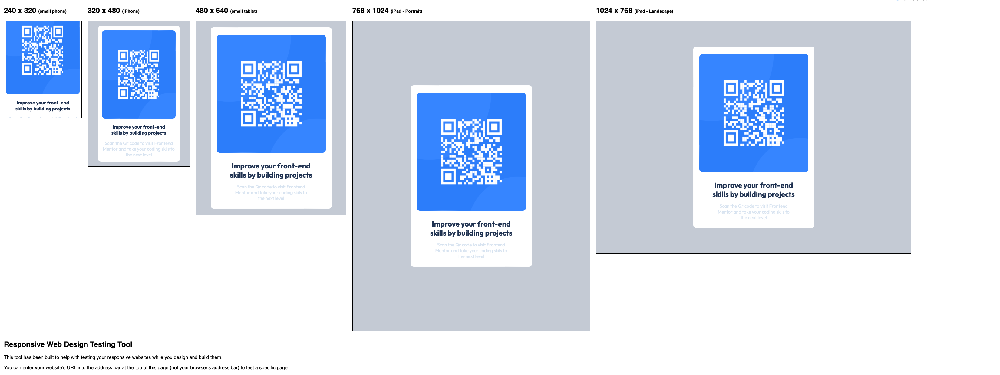
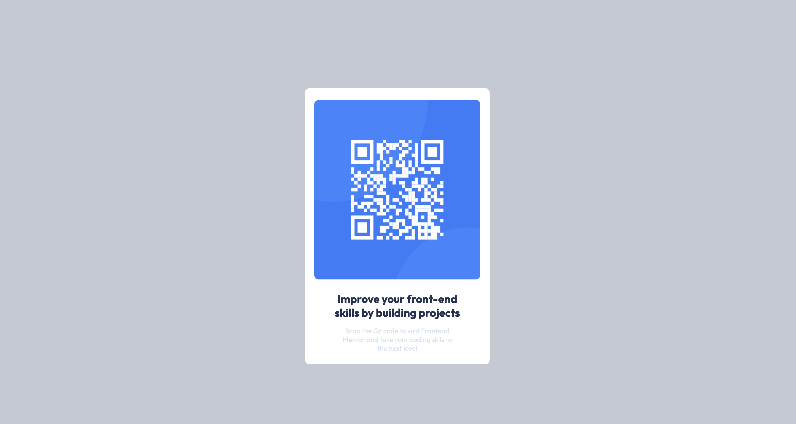

# Frontend Mentor - QR code component solution

This is a solution to the [QR code component challenge on Frontend Mentor](https://www.frontendmentor.io/challenges/qr-code-component-iux_sIO_H). Frontend Mentor challenges help you improve your coding skills by building realistic projects. 

## Table of contents

-  QR code component solution
  - [Table of contents](#table-of-contents)
  - [Overview](#overview)
    - [Screenshot](#screenshot)
    - [Links](#links)
  - [My process](#my-process)
    - [Built with](#built-with)
    - [What I learned](#what-i-learned)
    - [Continued development](#continued-development)
  - [Author](#author)

## Overview
The QR code component is built using HTML and CSS. It consists of a container that holds the QR code image and  caption. The component is responsive and adapts to various screen sizes.

### Screenshot

### Links

- Solution URL: [Add solution URL here](https://your-solution-url.com)
- Live Site URL: (http://127.0.0.1:5500/index.html)

## My process

### Built with

- Semantic HTML5 markup
- CSS 
- Flexbox
  

### What I learned

How to use media queries for responsive web design

### Continued development

Responsive web design
(media queries)

## Author

- Frontend Mentor - [@yourusername](https://www.frontendmentor.io/profile/G-Gakii)
- Twitter - [@yourusername](https://www.twitter.com/Gallant_Gakii)

